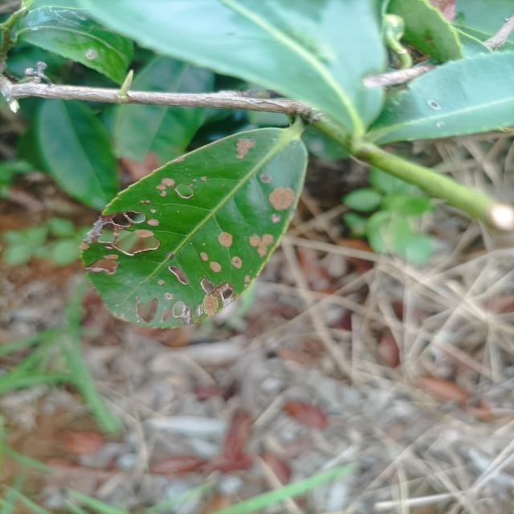
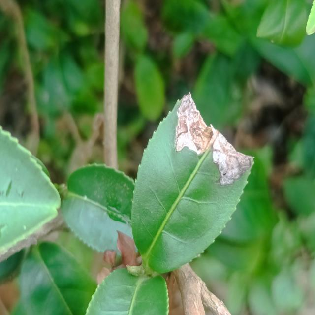
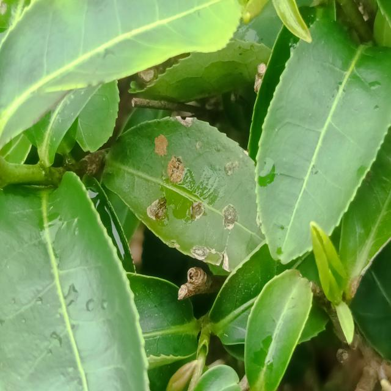
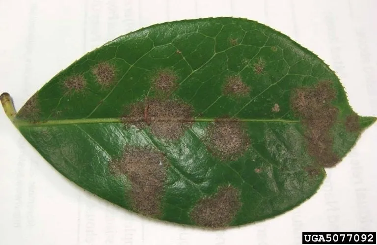
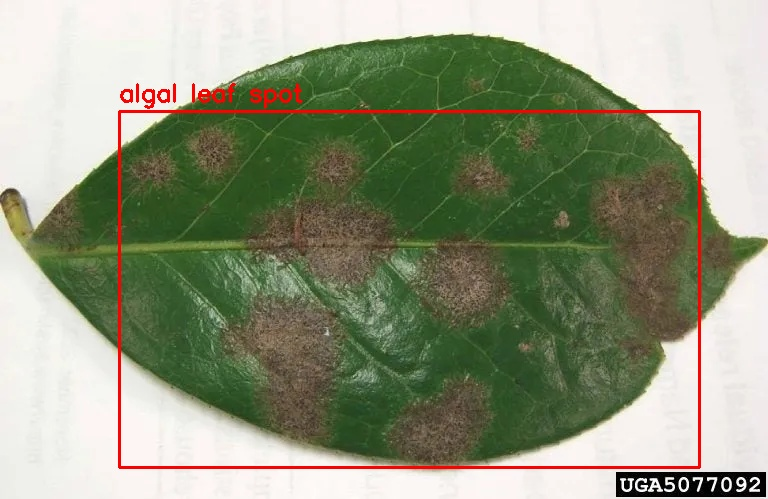

# 🍃 Tea Leaf Disease Detection

This project detects diseases on tea leaves using a YOLO-based object detection model. It identifies various leaf diseases from images and provides visual results.

---

## ✨ Features

* Detect multiple tea leaf diseases in images.
* Use YOLOv8 for object detection.
* Easy to train on custom datasets.

---

## 📊 Dataset

The model is trained on the **Tea Leaf Diseases Dataset**, which contains images of tea leaves with multiple disease types labeled for YOLO object detection. Each image may contain several affected areas. The dataset is organized into `train` and `valid` folders, each containing `images` and `labels` subfolders.

**🖼️ Dataset Samples:**





---

## ✨ Why YOLOv8?

YOLOv8 was chosen for this project because it provides **high speed, accuracy, and efficiency**. It supports:

* Detection of multiple diseased areas on a single leaf.
* Fast training and inference on limited GPU resources.
* Easy integration with Python and OpenCV.

---

## ⚡ Installation

Clone the repository:

```bash
git clone https://github.com/AmirSalajegheh/tea_leaf_diseases.git
cd tea_leaf_diseases
```

Install required Python packages:

```bash
pip install -r requirements.txt
```

---

## 🚀 Usage

After installing the requirements, you can run the detection and training scripts provided in the repository. Place your input images in the `Data` folder and the trained model `best.pt` is also stored there.

```bash
python main.py
```

* The output image with detected diseases will be saved in `Data/result.jpg`.
    
---

## 👨‍💻 Author

Developed by **Amir Salajegheh** 🚀
